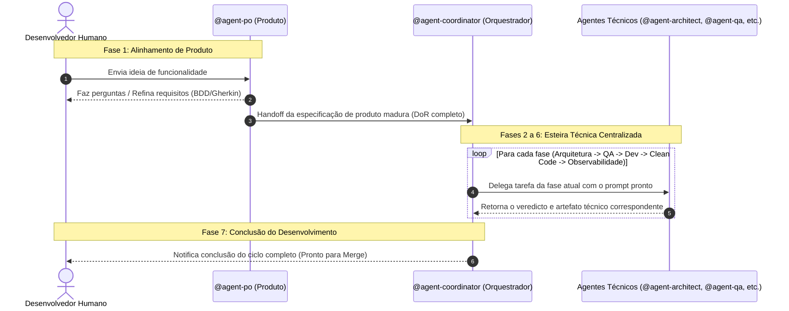

# Monorepo Agent Workflow Routing Rules

Este documento define e formaliza a governança de roteamento e fluxo de comunicação entre o usuário e a equipe de agentes de inteligência artificial do projeto.

---

## 🗺️ Fluxo de Comunicação (Visão Geral)

O fluxo de desenvolvimento é projetado como uma esteira centralizada. A comunicação segue uma hierarquia estrita para evitar dispersão de escopo e garantir conformidade técnica antes de qualquer alteração de código.

---

## 🔒 Regras de Roteamento de Comunicação

### 1. Interação Inicial com o Humano (`Humano ↔ @agent-po`)
- **Diretriz**: O desenvolvedor humano interage diretamente com o `@agent-po` para conceber e detalhar os requisitos da funcionalidade.
- **Regra**: O `@agent-po` está autorizado a conversar diretamente com o humano para esclarecer ambiguidades de negócio, mapear riscos de compliance e LGPD, e delimitar o escopo do MVP.

### 2. Transição de Produto para Engenharia (`@agent-po → @agent-coordinator`)
- **Diretriz**: Concluído o refinamento, o `@agent-po` repassa a especificação madura para a engenharia.
- **Regra**: O `@agent-po` não fala com outros agentes técnicos e não delega tarefas. Seu único destino de handoff técnico é o `@agent-coordinator`.

### 3. Orquestração Centralizada (`@agent-coordinator ↔ Agentes Técnicos`)
- **Diretriz**: O `@agent-coordinator` age como o hub e orquestrador central de todo o time técnico.
- **Regra**: Apenas o `@agent-coordinator` pode iniciar as chamadas para os demais agentes. Ele cria os prompts instruindo cada agente técnico a realizar sua atividade específica com o contexto acumulado das fases anteriores.
- **Lista de Agentes Técnicos sob Orquestração**:
  - `@agent-architect` (Fase 2)
  - `@agent-qa` (Fase 3)
  - `@agent-dev-backend` / `@agent-dev-frontend` (Fase 4)
  - `@agent-clean-code` (Fase 5)
  - `@observability-lgtm` (Fase 6)

### 4. Retorno Obrigatório ao Hub (`Agentes Técnicos → @agent-coordinator`)
- **Diretriz**: Centralização de estado.
- **Regra**: **Nenhum** agente técnico está autorizado a falar diretamente com o usuário humano ou passar a bola diretamente para outro agente. Ao final de sua execução, cada agente técnico deve obrigatoriamente reportar seu resultado de volta para o `@agent-coordinator`. O coordenador validará se os critérios de aceite da fase foram atingidos antes de seguir na esteira.
- **Relação com o Humano**: O desenvolvedor humano só recebe a mensagem final de conclusão do `@agent-coordinator` na Fase 7, após a validação bem-sucedida de todas as fases.

### 5. Tarefas de CI/CD (`Humano → @agent-cicd`)
- **Diretriz**: Tarefas exclusivamente de CI/CD (GitHub Actions, Docker, deploy, infra) podem ser invocadas **diretamente pelo humano**, sem passar pela esteira completa de 7 fases.
- **Regra**: O `@agent-cicd` está autorizado a conversar diretamente com o humano para analisar workflows, auditar pipelines, migrar runtimes de Actions e otimizar builds. Ele **não** passa pela esteira PO → Arquiteto → QA → Dev → Clean Code → OTEL.
- **Exceção**: Se a tarefa de CI/CD envolver mudanças de comportamento funcional (não apenas infra), o `@agent-cicd` deve redirecionar para o `@agent-po` via `@agent-coordinator`.

### 6. CI/CD Integrado à Esteira (`@agent-coordinator → @agent-cicd`)
- **Diretriz**: Quando uma tarefa da esteira envolve mudanças em arquivos de CI/CD (`.github/workflows/`, `Dockerfile`, `docker-compose.yml`, `render.yaml`), o `@agent-coordinator` pode invocar o `@agent-cicd` como **fase adicional** após a Fase 6 (Telemetria) e antes da Fase 7 (Finalização).
- **Regra**: O `@agent-cicd` retorna seu resultado diretamente ao `@agent-coordinator`. Se houver findings bloqueadores (`CI-xx`), a esteira não avança para a Fase 7.
